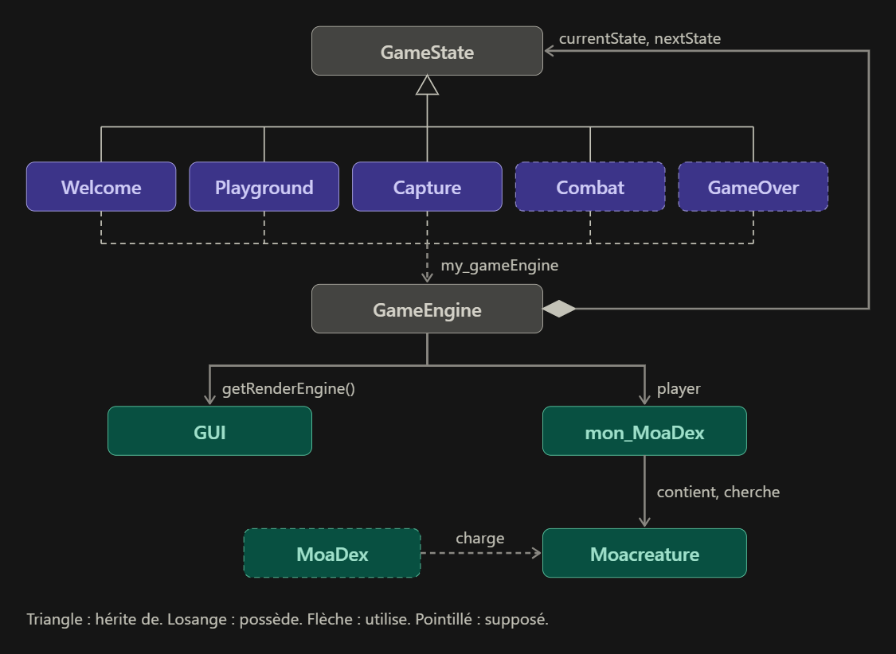

**Projet 3IS : Adaptation d'un célèbre jeu en C++**

Ceci est ma réponse au TP1 d'introduction de C++.

Pour faciliter la relecture, voici le nom que j'ai choisi pour les différentes classes à écrire.

|Nom classe Pokemon| Equivalent sur mon projet|Description|
|---|---|---|
|**Pokemon (.hpp ou .cpp)**|**Moacreture** (.h ou .cpp)|Creature de base|
|**Pokemon_Vector** Ou **SetOfCollections**|**Collections_Moacreature**|Classe abstraite, modèle pour n'importe quelle collection de creatures|
|**Pokemon Party**|**mon_MoaDex**|Classe concernant toutes les créatures possédées par le joueur, pas de limite de taille|
|**Pokedex**|**MoaDex**|liste de toutes les créatures disponibles dans le jeu|

Diagramme des classes : 

Le jeu contient beaucoup de bugs mais l'idée est là. C'est en cours d'amélioration.

Liste des tâches restantes :

|ToDo|Status|
|---|---|
|Corriger la suppression de creature dans la collection|Fait|
|Ajouter l'interface Graphique| A améliorer|
|Faire du code propre| En cours|